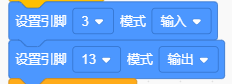
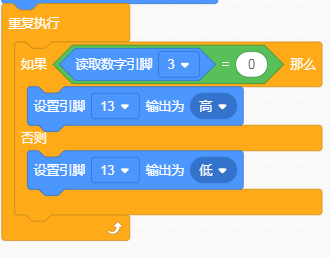

# KidsBlock

## 1. KidsBlock简介  

KidsBlock是一款为儿童和初学者设计的图形化编程工具，旨在通过直观的拖放式界面，让用户轻松创建交互式程序。用户无需深入理解复杂的编程语言，可以通过拼接模块实现各种功能。KidsBlock支持与Arduino硬件结合，使得用户能够实现多种创意项目，如传感器控制和机器人制作。其友好的用户界面以及丰富的模块选择，使得编程变得更加有趣和容易，适用于教育和创作场景，帮助学生和新手迅速掌握编程基础。  

## 2. 连接图  

  

## 3. 测试代码  

1. 在事件栏拖出Arduino启动模块。  

     

2. 在引脚栏拖出两个设置引脚模式模块，一个设置为引脚3输入，另一个设置为引脚13输出。  

     

3. 在控制栏拖出重复执行模块。  

     

4. 在控制栏拖出判断模块，然后在判断模块里添加运算的等于模块，等于模块的左边添加读取数字引脚3模块，右边为0；满足条件放第13引脚输出高电平，不满足第13引脚输出低电平。  

     

## 4. 测试结果  

按照上图接好线，烧录好代码后，上电后，传感器在检测到黑色或没有检测到东西时，板上的D13指示灯不亮，传感器上D1指示灯不亮；传感器在检测到其他颜色时，信号端输出高电平，板上的D13指示灯亮，传感器上D1指示灯亮起。旋转电位器可调节灵敏度，将D1调节至亮与不亮的临界点时，灵敏度最高。

