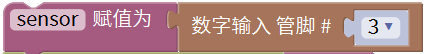
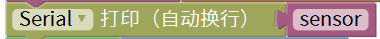
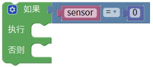
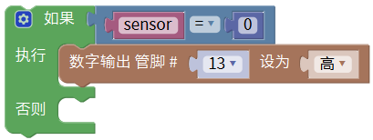
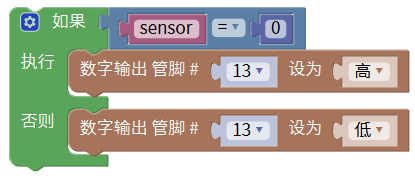

# Mixly

## 1. Mixly简介  

Mixly是一款图形化编程工具，专为儿童和初学者设计，目的是通过直观的拖放方式来简化编程过程。它的模块化设计允许用户通过拼装不同的功能模块实现多种应用，而无需深入学习编程语言。Mixly支持Arduino的开发，可以用于多种项目，比如传感器控制、机器人制作等。其友好的用户界面和丰富的模块选择，使得编程变得简单有趣，适合教育场景，帮助学生和新手更好地理解编程概念和逻辑。  

## 2. 连接图  

  

## 3. 测试代码  

1. 在变量栏找到声明全局变量模块，将item变量名改为“sensor”，这里修改变量名是方便我们理解与记忆。设置sensor初始变量为整数，并赋值为0。  

     

2. 初始化设置波特率为9600，波特率是串口通信传输的一个速度量，这里表示9600bit每秒。  

     

3. 我们在变量栏里拖出sensor赋值模块，然后在输入/输出栏拖出数字引脚输入模块，设置引脚为3。  

     

4. 找到并拖出串口栏下的打印并自动换行模块，然后在变量下找到我们定义的变量sensor，放在打印模块后面。  

     

5. 在控制栏拖出判断模块并点击模块上的设置图案，多设置一个否则。  

     

6. 在逻辑栏拖出一个等于模块，然后在里面添加变量sensor和数字0。  

     

7. 在输入/输出栏拖出设置引脚模块，设置引脚为13，高电平。  

     

8. 在输入/输出栏拖出设置引脚模块，设置引脚为13，低电平。  

     

## 4. 测试结果  

按照上图接好线，烧录好代码，上电后，传感器在检测到黑色或没有检测到东西时，板上的D13指示灯不亮，传感器上D1指示灯不亮；传感器在检测到其他颜色时，信号端输出高电平，板上的D13指示灯亮，传感器上D1指示灯亮起。旋转电位器可调节灵敏度，将D1调节至亮与不亮的临界点时，灵敏度最高。

