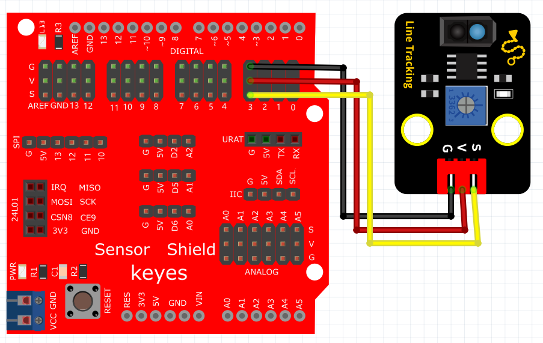

# Python


## 1. Python简介  

Python是一种高级编程语言，以其易于阅读、简洁的语法和强大的功能受到广泛欢迎。它被广泛应用于数据分析、机器学习、web开发、自动化脚本及嵌入式系统等领域。Python拥有一个活跃的开发社区和丰富的第三方库，用户可以利用它来快速开发原型、进行科研计算或者构建复杂的软件应用。Python的跨平台特性使得它能够在各种操作系统上运行，兼容性良好，适合初学者和专业开发者使用。此外，Python的标准库提供了丰富的模块，可以直接调用进行各种任务的处理，使得开发过程更加高效。  

## 2. 连接图  

  

## 3. 测试代码  

```python  
import machine  

import utime  

key = machine.Pin(28, machine.Pin.IN)  # 设置28脚为输入  
led = machine.Pin(25, machine.Pin.OUT)  # 设置25脚为输出  

while True:  
    if key.value() == 0:  # 判断输入是否为低电平  
        led.value(1)  # LED灯亮  
    else:  # 否则  
        led.value(0)  # LED灯灭  
```  

## 4. 测试结果  

按照上图接好线，烧录好代码，上电后，传感器在检测到黑色或没有检测到东西时，板上的D13指示灯不亮，传感器上D1指示灯不亮；传感器在检测到其他颜色时，信号端输出高电平，板上的D13指示灯亮，传感器上D1指示灯亮起。旋转电位器可调节灵敏度，将D1调节至亮与不亮的临界点时，灵敏度最高。


